# Taxonomy Architecture

> Last updated: 2026-02-12

## Overview

The taxonomy module organizes questions into a **3-level hierarchy**: Branch → Chapter → Concept Tag.

```mermaid
graph TD
    subgraph "Hierarchy"
        B1["🧪 Physical Chemistry"]
        B2["⚛️ Inorganic Chemistry"]
        B3["🌿 Organic Chemistry"]
        B1 --> C1["chapter_atomic_structure"]
        B1 --> C2["chapter_thermodynamics"]
        B2 --> C3["chapter_chemical_bonding"]
        B3 --> C4["chapter_hydrocarbons"]
        C1 --> T1["TAG_ATOM_MODELS"]
        C1 --> T2["TAG_ATOM_QUANTUM"]
    end
```

---

## Data Flow

---

## Key Files

| File | Role |
|---|---|
| `lib/models.ts` | Mongoose schema — **canonical model** |
| `app/the-crucible/actions.ts` | `getTaxonomy()`, `saveTaxonomyNode()`, `deleteTaxonomyNode()` |
| `app/the-crucible/types.ts` | `TaxonomyNode` interface |
| `app/the-crucible/admin/taxonomy/page.tsx` | Kanban taxonomy dashboard |
| `app/the-crucible/admin/TagManager.tsx` | Tag picker in question editor |

---

## ID Format

| Entity | Format | Example |
|---|---|---|
| Branch | `TAG_BRANCH_<NAME>` | `TAG_BRANCH_PHYSICAL` |
| Chapter | `chapter_<snake_case>` | `chapter_atomic_structure` |
| Concept Tag | `TAG_<PREFIX>_<NAME>` | `TAG_ATOM_QUANTUM_NUMBERS` |

---

## Database State (278 docs)

| Type | Count | Parent |
|---|---|---|
| Branches | 3 | `null` |
| Chapters | 36 | A `TAG_BRANCH_*` |
| Concept Tags | 239 | A `chapter_*` |

### Chapters by Branch

| Physical Chemistry (12) | Inorganic Chemistry (11) | Organic Chemistry (13) |
|---|---|---|
| Mole Concept | Periodic Properties | GOC |
| Atomic Structure | Chemical Bonding | Stereochemistry |
| Gaseous State | Hydrogen | Hydrocarbons |
| Thermodynamics | s-Block Elements | Aromatic Compounds |
| Chemical Equilibrium | p-Block (13-14) | Haloalkanes & Haloarenes |
| Ionic Equilibrium | p-Block (15-18) | Alcohols, Phenols & Ethers |
| Solid State | Metallurgy | Aldehydes & Ketones |
| Solutions | d & f Block | Carboxylic Acids |
| Electrochemistry | Coordination Compounds | Amines |
| Chemical Kinetics | Salt Analysis | Biomolecules |
| Surface Chemistry | Environmental Chemistry | Polymers |
| Redox Reactions | | Everyday Life |
| | | Practical Organic |

---

## Known Issues

- **15 questions** have `null` chapter_ids with no tags to infer from. These need manual chapter assignment via the admin dashboard.

---

## Migration History

| Date | Change |
|---|---|
| 2026-02-12 | Migrated 34 chapter IDs: `TAG_CH_*` → `chapter_*` |
| 2026-02-12 | Fixed 80+ question chapter_ids |
| 2026-02-12 | Merged `taxonomies` collection into `taxonomy`, dropped duplicate |
| 2026-02-12 | Removed skill tags, merged 3 duplicate chapters |
| 2026-02-12 | Assigned all 36 chapters to branches |
| 2026-02-12 | Rebuilt admin dashboard as Kanban board |
| 2026-02-12 | Fixed old `TAG_CH_*` refs in `data.ts` |
